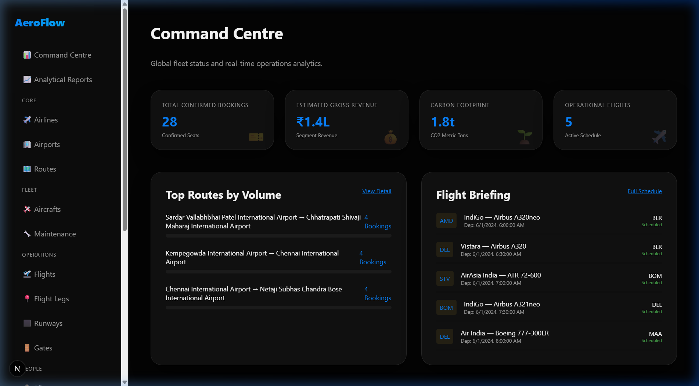
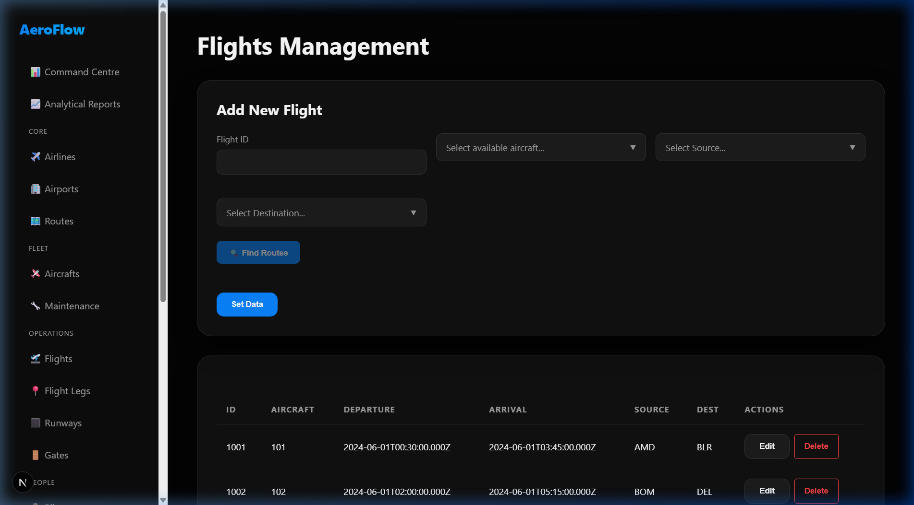
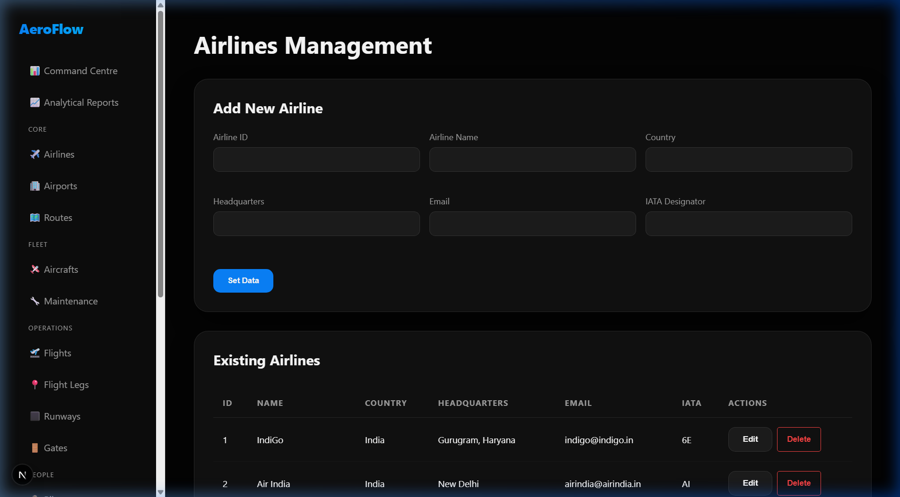
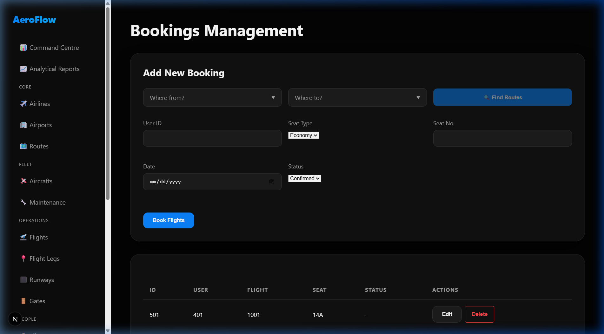
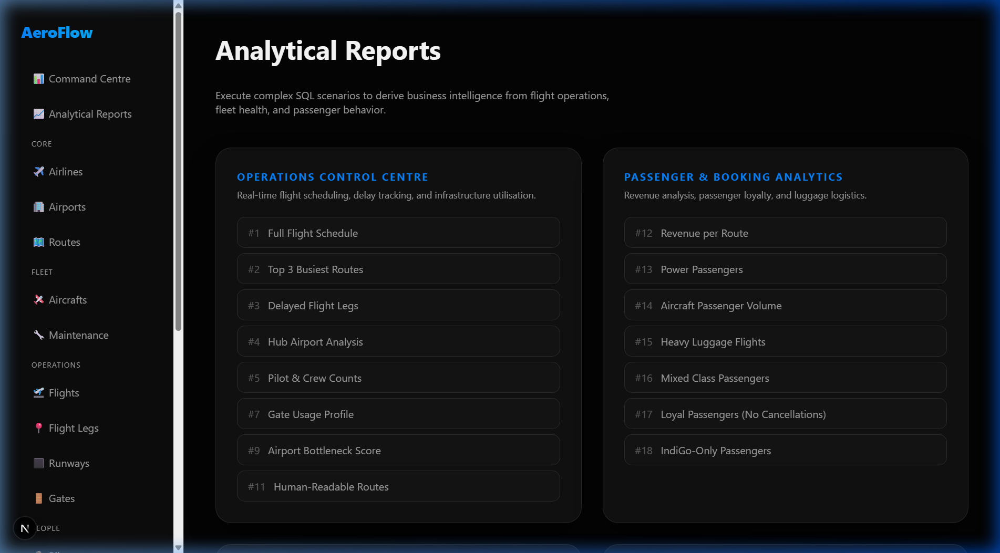
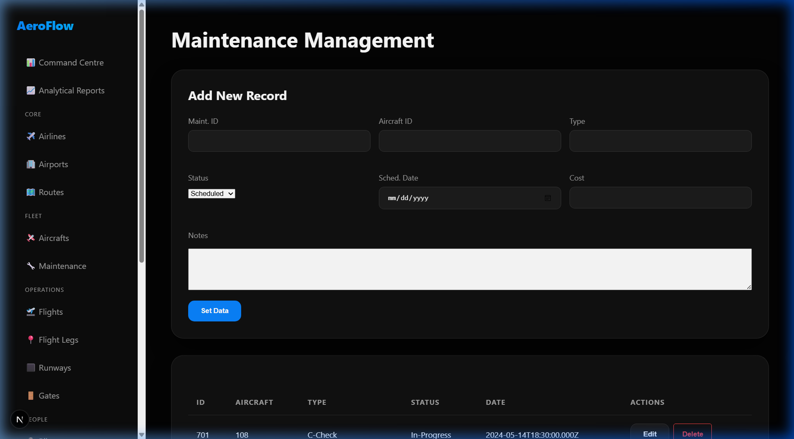
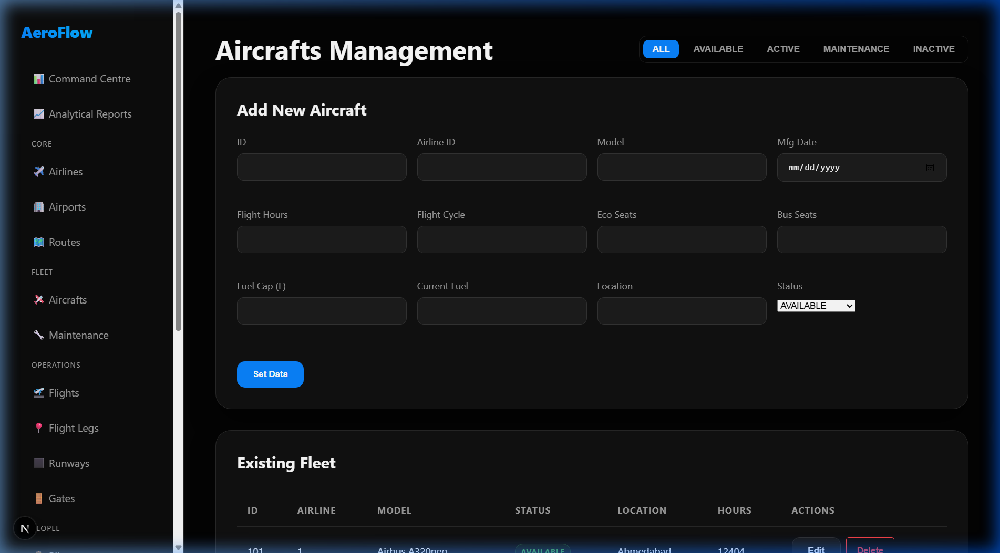
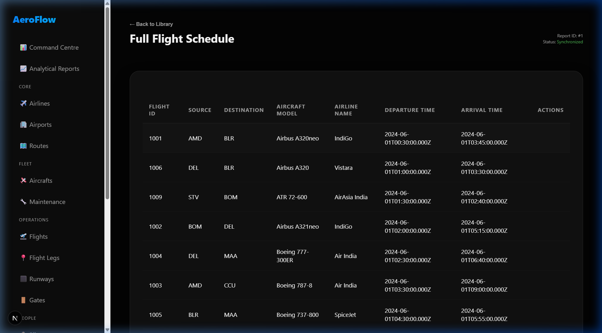

# ✈️ AeroFlow — Aviation Management System

> **A full-stack airline operations platform powered by PostgreSQL, demonstrating advanced DBMS concepts including stored procedures, triggers, transactions, and 37 real-world analytical queries.**

---

## 🔷 Project Overview

**AeroFlow** is a comprehensive aviation management system designed to simulate the real-world operational needs of a modern airline. It manages everything from aircraft fleet status and flight scheduling to passenger bookings, cargo handling, crew assignments, and infrastructure utilisation across airports.

The system is built as a full-stack web application with a **Next.js** frontend, a **Node.js/Express-style API layer** (via Next.js API routes), and a **PostgreSQL** backend as the single source of truth — with business logic pushed almost entirely into the database through stored functions, triggers, and transactions.

### What Problem Does It Solve?

| Domain | Problem Solved |
|--------|---------------|
| **Operations Control** | Real-time flight scheduling, delay detection, hub identification |
| **Fleet Management** | Aircraft lifecycle tracking, fuel validation, maintenance compliance |
| **Passenger Experience** | Booking management, loyalty tier assignment, luggage tracking |
| **Financial Reporting** | Revenue per route, maintenance cost efficiency, carbon footprint |
| **Safety & Compliance** | DGCA rest-period violations, pilot workload classification |
| **Infrastructure** | Runway/gate utilisation, airport bottleneck scoring |

---

## 🖼️ Screenshots

### Command Centre (Dashboard)


### Flight Management


### Airlines Registry


### Booking Management


### Analytical Reports


### Maintenance Tracking


### Aircraft Fleet


### Query Results


---

## 🧠 DBMS-Focused Features

| Feature | Description |
|---------|-------------|
| **Schema Design** | 18 tables with composite PKs, FKs, and NOT NULL constraints |
| **Stored Functions** | 50+ PL/pgSQL functions replacing raw JS queries |
| **Triggers** | 8 reactive triggers for auto-validation and status sync |
| **Transactions** | Atomic multi-step operations with rollback on failure |
| **Views** | 4 enriched views used by the frontend API layer |
| **Analytics** | 37 analytical queries wrapped as callable DB functions |
| **Custom Error Codes** | Structured exception prefixes mapped to HTTP status codes |

---

## 🗄️ Database Schema Overview

> **Schema:** `AeroFlow` | **Database:** PostgreSQL 10+

### Tables and Their Purpose

| # | Table | Purpose |
|---|-------|---------|
| 1 | `Airline` | Airline registry (Name, Country, IATA code) |
| 2 | `Aircraft` | Fleet registry with real-time telemetry (fuel, altitude, speed) |
| 3 | `Maintenance` | Scheduled and completed maintenance events per aircraft |
| 4 | `Airport` | Airport registry with IATA codes |
| 5 | `Runway` | Runway inventory per airport (composite PK) |
| 6 | `Gate` | Gate inventory per airport (composite PK) |
| 7 | `Route` | Named origin-destination pair with distance and estimated duration |
| 8 | `Flight` | A flight event linking aircraft, departure/arrival airports and times |
| 9 | `Flight_Legs` | Individual legs of a multi-stop flight (composite PK) |
| 10 | `Pilot` | Pilot registry with license and experience level |
| 11 | `Crew` | Cabin crew registry with role and language proficiency |
| 12 | `User` | Passenger registry |
| 13 | `Booking` | Seat booking linking passenger to a specific flight leg |
| 14 | `Luggage` | Checked luggage per booking (≤50 kg per piece validated) |
| 15 | `Pilot_Assign` | Many-to-many: pilots assigned to flight legs |
| 16 | `Crew_Assign` | Many-to-many: crew assigned to flight legs |
| 17 | `Uses_Runway` | Tracks which runway a flight leg used (takeoff / landing) |
| 18 | `Uses_Gate` | Tracks which gate a flight leg used (departure / arrival) |

### Entity-Relationship Overview (Textual ER Diagram)

```
AIRLINE (1) ──────────── (N) AIRCRAFT
                                │
                   ┌────────────┼────────────────┐
                   │            │                │
              MAINTENANCE    FLIGHT (N)────(1) AIRPORT
                              │   │
                          FLIGHT_LEGS ──── ROUTE ──── AIRPORT
                          (PK: flight_id, route_id, leg_seq_no)
                         /      │       \
              BOOKING(N)  PILOT_ASSIGN  CREW_ASSIGN
                │          │                │
             LUGGAGE     PILOT            CREW
             USER ────────┘
             
             USES_RUNWAY ──── RUNWAY (composite PK)
             USES_GATE   ──── GATE   (composite PK)
```

### Key Design Decisions

- **Composite Primary Keys**: `Flight_Legs`, `Runway`, `Gate`, `Pilot_Assign`, `Crew_Assign`, `Uses_Runway`, and `Uses_Gate` all use composite PKs reflecting real-world composite identifiers.
- **`Flight_Legs` as the Hub**: Bookings, pilot assignments, crew assignments, runway usage, and gate usage all reference the `Flight_Legs` composite key — making the leg the atomic unit of operations.
- **Normalization**: The schema is in **3rd Normal Form (3NF)** — all non-key attributes depend only on the primary key. Route distance/duration is separated from Flight (transitive dependency removed).
- **Aircraft Telemetry Fields**: `Aircraft` stores real-time fields (`Current_Speed`, `Altitude`, `Cabin_Pressure_PSI`, `Autopilot_Status`, `Is_In_Aviation`) enabling live fleet monitoring.
- **IATA Code Uniqueness**: Enforced both at trigger level and inside the `insert_airport` stored function as a double safety net.

---

## ⚙️ Stored Procedures, Functions & Triggers

### Section 1 — Database Views (Schema Helpers)

| View | Purpose |
|------|---------|
| `v_flight_schedule` | Enriched flight list with IATA codes, model, airline name, and duration hours — used by the API `/api/flights` |
| `v_aircraft_detail` | Aircraft joined with airline info, total seat count, and fuel percentage |
| `v_booking_detail` | Full booking view: passenger name/email, route IATA codes, departure/arrival times |
| `v_maintenance_detail` | Maintenance joined with aircraft model and airline name |

---

### Section 2 — Stored Read Functions (`get_*`)

These are SQL `STABLE` functions that serve as a clean read interface for the API layer.

| Function | Returns | Description |
|----------|---------|-------------|
| `get_airlines()` | `SETOF airline` | Full airline list |
| `get_aircrafts()` | `SETOF aircraft` | Full aircraft list |
| `get_airports()` | `SETOF airport` | Full airport list |
| `get_users()` | `TABLE(user_id, name, email, phone, address)` | Full user list |
| `get_flights()` | `SETOF v_flight_schedule` | Enriched flight schedule via view |
| `get_flight_by_id(p_id)` | `SETOF v_flight_schedule` | Single flight lookup |
| `get_bookings()` | `SETOF booking` | All bookings |
| `get_maintenance()` | `SETOF maintenance` | All maintenance records |
| `get_flight_legs()` | `SETOF flight_legs` | All flight legs, ordered |
| `check_airline_exists(p_id)` | `BOOLEAN` | Existence check |
| `check_aircraft_exists(p_id)` | `BOOLEAN` | Existence check |
| `get_aircraft_status(p_id)` | `VARCHAR` | Returns `Status_Type` |
| `get_available_aircraft()` | `TABLE(...)` | Aircraft with status = `AVAILABLE` |

---

### Section 3 — Stored Write Procedures (`insert_*`, `update_*`, `delete_*`)

All write operations are encapsulated in PL/pgSQL functions with full input validation, raising structured exceptions caught by the API layer.

**Exception Prefix → HTTP Status Mapping:**

| Exception Prefix | HTTP Status | Meaning |
|-----------------|-------------|---------|
| `VALIDATION_ERROR:` | 400 | Invalid input values |
| `DUPLICATE_ERROR:` | 409 | Record already exists |
| `NOT_FOUND:` | 404 | Referenced record missing |
| `CONSTRAINT_ERROR:` | 400 | Business rule violation |
| `CAPACITY_ERROR:` | 409 | No seats available |
| `BUSINESS_RULE:` | 422 | Forbidden operation |

**Key Write Functions:**

| Function | Validates | Side Effects |
|----------|-----------|--------------|
| `insert_airline(...)` | Null check, duplicate ID | — |
| `insert_aircraft(...)` | Null check, parent airline exists, duplicate ID, fuel ≤ capacity | — |
| `insert_airport(...)` | Null check, duplicate ID, **IATA uniqueness** | — |
| `insert_user(...)` | Null check, duplicate ID, **unique email** | — |
| `insert_flight(...)` | All fields required, arrival > departure, src ≠ dest, aircraft AVAILABLE | Trigger sets aircraft → ACTIVE, increments hours |
| `update_flight(...)` | Old/new aircraft validity, time integrity | Aircraft hour delta adjusted; old aircraft released if swapped |
| `insert_booking(...)` | Seat type valid, flight leg exists, seat capacity check, duplicate seat | — |
| `insert_maintenance(...)` | Aircraft exists, date integrity | Trigger syncs aircraft status |
| `insert_flight_leg(...)` | Flight exists, route exists, time integrity, duplicate composite PK | — |
| `insert_luggage(...)` | Booking exists, weight > 0 and ≤ 50 kg | — |
| `assign_pilot(...)` | Leg exists, pilot exists, no duplicate assignment | — |
| `assign_crew(...)` | Leg exists, crew exists, no duplicate assignment | — |
| `cascade_delete_aircraft(p_id)` | Aircraft exists | Cascades: Luggage → Booking → Crew/Pilot Assign → Gate/Runway Usage → Flight Legs → Flights → Maintenance → Aircraft |
| `cascade_delete_flight(p_id)` | Flight exists | Cascades: Luggage → Booking → Crew/Pilot Assign → Gate/Runway → Legs → Flight |

---

### Section 4 — Business Logic Functions (`fn_*`)

Derived computations that live in the database, not in JavaScript:

| Function | Input | Output | Description |
|----------|-------|--------|-------------|
| `fn_flight_duration_hours(p_flight_id)` | Flight ID | `NUMERIC` | Ceiling of hours between departure and arrival |
| `fn_check_seat_available(flight, route, leg, type)` | Composite leg keys + seat type | `BOOLEAN` | True if seats remain (excludes cancelled) |
| `fn_loyalty_tier(p_user_id)` | User ID | `VARCHAR` | Bronze / Silver / Gold / Platinum based on confirmed KM flown |
| `fn_aircraft_load_factor(p_flight_id)` | Flight ID | `NUMERIC` | Confirmed bookings ÷ total seat capacity × 100 |
| `fn_pilot_workload_tier(p_pilot_id)` | Pilot ID | `VARCHAR` | Heavy (>4 legs) / Moderate (≥2) / Light |
| `fn_co2_metric_tons(p_airline_id)` | Airline ID | `NUMERIC` | Distance × 0.115 kg/km, converted to metric tons |
| `fn_maintenance_cost_per_booking(p_aircraft_id)` | Aircraft ID | `NUMERIC` | Total maintenance cost ÷ confirmed bookings |
| `fn_detect_crew_rest_violations()` | — | `TABLE` | Crew on consecutive flights with < 10 h rest |
| `fn_airport_bottleneck_score()` | — | `TABLE` | Runway + gate ops per airport, sorted by activity |
| `fn_route_string(p_flight_id)` | Flight ID | `TEXT` | Human route string: `Ahmedabad -> Mumbai -> Bengaluru` |

---

### Section 5 — Triggers

| Trigger | Table | When | Effect |
|---------|-------|------|--------|
| `trg_flight_after_insert` | `flight` | AFTER INSERT | Sets aircraft status → `ACTIVE`; adds flight hours to tally |
| `trg_flight_after_delete` | `flight` | AFTER DELETE | Deducts flight hours; if no flights remain, sets aircraft → `AVAILABLE` |
| `trg_maintenance_status_sync` | `maintenance` | AFTER INSERT OR UPDATE | `Completed` → aircraft `AVAILABLE`; any other status → `INACTIVE` |
| `trg_validate_flight_times` | `flight` | BEFORE INSERT OR UPDATE | Rejects arrival ≤ departure; rejects same source and destination |
| `trg_validate_leg_times` | `flight_legs` | BEFORE INSERT OR UPDATE | Rejects landing ≤ takeoff |
| `trg_validate_fuel` | `aircraft` | BEFORE INSERT OR UPDATE | Rejects current fuel > total fuel capacity |
| `trg_validate_maintenance_dates` | `maintenance` | BEFORE INSERT OR UPDATE | Rejects completion date before start date |
| `trg_audit_booking_status` | `booking` | BEFORE UPDATE | Prevents reinstating a `Cancelled` booking to `Confirmed` |

---

### Section 6 — Constraint Helper Functions (`fn_assert_*`)

| Function | Purpose |
|----------|---------|
| `fn_assert_iata_unique(p_iata, p_exclude_id?)` | Returns `FALSE` if IATA code already taken |
| `fn_assert_seat_type_valid(p_seat_type)` | Returns `TRUE` only for `ECONOMY` or `BUSINESS` |
| `fn_assert_no_duplicate_seat(...)` | Returns `TRUE` if seat is still free on the leg |
| `fn_assert_aircraft_status_valid(p_status)` | Validates: `AVAILABLE`, `ACTIVE`, `INACTIVE`, `MAINTENANCE`, `GROUNDED` |

---

### Section 7 — Transaction Wrappers

#### `txn_book_passenger(...)` — Atomic Passenger Booking

Wraps booking creation + optional luggage attachment in a single transaction:

```sql
-- Step 1: Validate leg, seat capacity, duplicate check → INSERT booking
-- Step 2: If luggage provided → INSERT luggage (same transaction)
-- On any error: full rollback — no half-booked records
```

**Inputs:** `booking_id`, `flight_id`, `route_id`, `leg_seq`, `user_id`, `seat_type`, `seat_number`, `booking_date`, `status`, `booking_seq`, `luggage_id?`, `luggage_tag?`, `luggage_weight?`

#### `txn_schedule_flight(...)` — Atomic Flight + Legs Scheduling

Schedules a complete multi-leg flight atomically:

```sql
-- Step 1: INSERT flight (validates aircraft status)
-- Step 2: Loop through route_ids[], INSERT each flight_leg
-- On any failure: entire flight + all its legs are rolled back
```

**Inputs:** `flight_id`, `aircraft_id`, `dep_time`, `arr_time`, `src_airport`, `dest_airport`, plus arrays `p_route_ids[]`, `p_leg_seqs[]`, `p_takeoffs[]`, `p_landings[]`, `p_leg_statuses[]`

---

## 📊 Query Scenarios

> **File:** `AeroFlow_Queries_Solutions.sql` | **4 Scenarios | 37 Queries**

### 🛫 Scenario 1: Flight Scheduling & Operations Center

**Real-World Problem:** AeroFlow's Operations Control Centre (OCC) needs real-time dashboards to schedule flights, track delays, identify hub airports, and assign pilots.

| Query | Purpose | Key SQL Techniques |
|-------|---------|-------------------|
| Q1 — Full Flight Schedule | Morning briefing: all flights with IATA codes, aircraft, airline | Multi-table JOIN, ORDER BY |
| Q2 — Top 3 Routes by Booking Volume | Revenue management: busiest routes | Aggregation with COUNT, GROUP BY, LIMIT |
| Q3 — Delayed Flight Legs | OCC flags legs where actual > planned duration | `EXTRACT(EPOCH...)`, arithmetic on timestamps, ROUND |
| Q4 — Hub Airports | Network planning: airports at both ends of routes | `INTERSECT` set operator on subqueries |
| Q5 — Pilots & Crew per Flight | OCC verifies minimum staffing | Correlated subqueries (`SELECT COUNT` in projection) |
| Q6 — Routes with Avg Booking > 1/Leg | Yield management | Subquery in FROM, `HAVING AVG(...)`, `COALESCE` |
| Q7 — Gate Utilisation (Idle vs Used) | Ground staff redeployment | `LEFT JOIN`, `CASE WHEN`, aggregation |
| Q8 — Multi-Leg Passenger Itinerary | Check-in agent view: full journey + total luggage | `STRING_AGG` with ORDER BY, `GROUP BY`, `HAVING COUNT > 1` |
| Q9 — Airport Bottleneck Analysis | Infrastructure planning: combined runway + gate score | Two-CTE pattern (`WITH ... AS`), `COALESCE` |
| Q10 — Pilot Roster per Flight | OCC pilot roster sheet | JOIN + ORDER BY leg sequence |
| Q11 — Human-Readable Route String | Departure boards | CTE + `STRING_AGG` with ORDER BY |

---

### 🧳 Scenario 2: Passenger Experience & Booking Analytics

**Real-World Problem:** The Customer Experience team analyses passenger behaviour — who books most, highest revenue routes, luggage loads, and airline loyalty patterns.

| Query | Purpose | Key SQL Techniques |
|-------|---------|-------------------|
| Q12 — Revenue per Route | Quarterly P&L report (Economy ₹4500, Business ₹8000) | `SUM(CASE WHEN seat_type...)`, GROUP BY |
| Q13 — Power Passengers | Loyalty programme: users with above-average bookings | Nested subquery as table alias (double aggregation) |
| Q14 — Bookings per Aircraft | Fleet utilisation: total + unique passengers per aircraft | `COUNT(DISTINCT)` with multi-table JOIN |
| Q15 — Heavy-Luggage Flights | Ground handling: flights > 200 kg total luggage | `HAVING SUM(l.Weight) > 200` |
| Q16 — Both Cabin Passengers | Upgrade campaigns | `EXISTS` + `EXISTS` dual-subquery |
| Q17 — Loyal Passengers (Never Cancelled) | Retention marketing | `NOT EXISTS` + `EXISTS` pattern |
| Q18 — IndiGo-Only Passengers | Partnership / co-branding analysis | **Relational Division** via `NOT EXISTS (... EXCEPT ...)` |
| Q19 — 2nd & 3rd Heaviest Luggage | Baggage screening queue | `OFFSET 1 LIMIT 2` on sorted aggregate |
| Q20 — Users with Same Route Footprint as User 401 | Travel buddy matching | `NOT EXISTS (... EXCEPT ...)` division logic |

---

### 🔧 Scenario 3: Fleet Health, Infrastructure & Crew Operations

**Real-World Problem:** Engineering must keep the fleet airworthy; Airport Managers must optimise infrastructure; Crew Operations must enforce duty regulations.

| Query | Purpose | Key SQL Techniques |
|-------|---------|-------------------|
| Q21 — Fleet Summary per Airline | Engineering Director monthly dashboard | `GROUP BY HAVING COUNT > 1`, AVG/MAX/MIN aggregation |
| Q22 — Maintenance Cost Stats | Finance: airlines over INR 50,000 spend | `HAVING SUM(cost) > 50000`, multi-aggregate |
| Q23 — Aircraft with More Hours than ALL GoFirst Aircraft | Safety audit for overutilisation | `> ALL (subquery)` |
| Q24 — Active Aircraft Returned to Service | Post-maintenance check | JOIN with double WHERE: status AND maintenance_status |
| Q25 — Maintenance Cost per Booking | CFO efficiency metric | `COALESCE(SUM(...), 0)` in CASE, LEFT JOIN pattern |
| Q26 — Runway Takeoffs vs Landings | ATC imbalance detection | `COUNT(CASE WHEN usage_type...)` inside GROUP BY |
| Q27 — Cabin Manager Performance | HR appraisal data | `STRING_AGG(DISTINCT ...)`, GROUP BY |
| Q28 — Pilot Workload Tier | DGCA duty-hour compliance | `CASE WHEN COUNT > threshold` classification |
| Q29 — Crew on ALL Legs of Flight 1001 | Safety audit completeness check | `NOT EXISTS (... EXCEPT ...)` — set difference division |
| Q30 — Pilots on ALL Legs of Flight 1003 | Command accountability | `NOT IN (CROSS JOIN ... EXCEPT ...)` — relational division |

---

### 📈 Scenario 4: Strategic Analytics, Sustainability & Risk Management

**Real-World Problem:** Leadership needs long-term insights — detecting ghost flights, managing CO₂ compliance, identifying gate conflicts, and pilot fatigue violations.

| Query | Purpose | Key SQL Techniques |
|-------|---------|-------------------|
| Q31 — Flight Load Factor | Finance: occupancy rate (< 50% flags ghost flights) | `HAVING (COUNT/capacity) < 0.50`, percentage arithmetic |
| Q32 — Frequent Flyer Tier Eligibility | Marketing: Platinum/Gold/Silver/Bronze loyalty tiers | Cumulative `SUM(distance)` + `CASE` tier classification |
| Q33 — Carbon Footprint per Airline | Environmental reporting (0.115 kg CO₂/km standard) | `SUM(distance * 0.115) / 1000`, mathematical modelling in SQL |
| Q34 — Crew Fatigue & Rest Period | DGCA compliance: flags < 10 h rest intervals | Self-join on `Crew_Assign`, `EXTRACT(EPOCH...)/3600` interval math |
| Q35 — Peak Hour Airport Congestion | Security and staffing optimisation | `EXTRACT(HOUR FROM departure_time)`, GROUP BY derived field |
| Q36 — Revenue Leakage from Cancellations | Cancellation financial impact analysis | Conditional `SUM(CASE...)` filtered by `Cancelled` status |
| Q37 — Seniority vs Route Difficulty Audit | Safety audit: junior pilots on long-haul routes | `AVG(distance)` GROUP BY experience level |

---

## 🌐 Web Application Integration

### Architecture

```
[Browser / React Frontend]
         │
         │  HTTP (REST API calls)
         ▼
[Next.js API Routes]   (src/app/api/**/route.js)
         │
         │  node-postgres (pg) Pool
         ▼
[PostgreSQL — AeroFlow Schema]
  └─ Views (v_flight_schedule, v_booking_detail, ...)
  └─ Functions (get_*, insert_*, update_*, cascade_delete_*)
  └─ Triggers (auto-sync flight hours, maintenance status)
  └─ Transaction Wrappers (txn_book_passenger, txn_schedule_flight)
```

### Database Connection (`src/lib/db.js`)

- **Singleton Pool Pattern**: One `pg.Pool` instance shared across Next.js hot reloads
- **Connection Limits**: `max: 10`, `min: 2` warm connections, `idleTimeoutMillis: 30s`
- **Schema Binding**: `search_path=aeroflow,public` set at connection level — zero extra SQL
- **Structured Error Handling**: Every stored function raises prefixed exceptions (`VALIDATION_ERROR: ...`). The `handleDbError()` helper maps these to correct HTTP status codes:

```javascript
// db.js — excerpt
if (msg.startsWith('VALIDATION_ERROR:'))  return { status: 400, body: { error: ... } };
if (msg.startsWith('DUPLICATE_ERROR:'))   return { status: 409, body: { error: ... } };
if (msg.startsWith('NOT_FOUND:'))         return { status: 404, body: { error: ... } };
if (msg.startsWith('CAPACITY_ERROR:'))    return { status: 409, body: { error: ... } };
if (msg.startsWith('BUSINESS_RULE:'))     return { status: 422, body: { error: ... } };
```

### API Structure

The `src/app/api/` directory contains route handlers for all 18 tables, each calling stored functions rather than raw SQL:

```
/api/airlines          → SELECT * FROM get_airlines()
/api/aircrafts         → SELECT * FROM get_aircrafts()
/api/flights           → SELECT * FROM get_flights()
/api/bookings          → SELECT * FROM get_bookings()
/api/maintenance       → SELECT * FROM get_maintenance()
/api/reports?id=<N>    → Calls rpt_q<N>_* analytics function
...
```

### Frontend Pages

| Page | URL | Features |
|------|-----|---------|
| **Command Centre** | `/` | KPI cards (bookings, revenue, CO₂, active flights), Top Routes bar chart, Flight Briefing table |
| **Analytical Reports** | `/reports` | All 37 query results accessible as individual report cards |
| **Airlines** | `/airlines` | Full CRUD: list, add, edit, delete airlines |
| **Aircrafts** | `/aircrafts` | Fleet registry with status badges, fuel level, cascade delete |
| **Airports** | `/airports` | Airport list with IATA codes |
| **Routes** | `/route-mgmt` | Route management with distance/duration |
| **Flights** | `/flights` | Flight schedule CRUD with aircraft assignment |
| **Flight Legs** | `/flight-legs` | Multi-leg management |
| **Runways** | `/runways` | Runway registry per airport |
| **Gates** | `/gates` | Gate registry per airport |
| **Pilots** | `/pilots` | Pilot registry with license and experience |
| **Crew** | `/crew` | Cabin crew with role and language proficiency |
| **Users** | `/users` | Passenger registry |
| **Bookings** | `/bookings` | Booking management with seat assignment |
| **Luggage** | `/luggage` | Luggage tracking per booking (50 kg limit enforced) |
| **Pilot Assign** | `/pilot-assign` | Assign pilots to flight legs |
| **Crew Assign** | `/crew-assign` | Assign crew to flight legs |
| **Runway Usage** | `/uses-runway` | Log runway takeoff/landing events |
| **Gate Usage** | `/uses-gate` | Log gate departure/arrival events |

---

## 📦 Sample Data Overview

> **File:** `AeroFlow_INSERT_Data.sql`

The sample dataset is modelled on **real Indian airlines and airports**:

| Entity | Count | Details |
|--------|-------|---------|
| **Airlines** | 5 | IndiGo, Air India, SpiceJet, Vistara, GoFirst |
| **Aircraft** | ~10 | A320, B737, A380 variants with realistic fuel capacities |
| **Airports** | ~10 | AMD, BOM, DEL, BLR, HYD, CCU, MAA, GOI, PNQ, JAI |
| **Routes** | ~15 | Realistic city-pair routes with distances in km |
| **Flights** | ~10 | Scheduled flights with departure/arrival timestamps |
| **Flight Legs** | ~20 | Multi-stop legs with takeoff/landing times |
| **Pilots** | ~10 | Licensed pilots across experience levels |
| **Crew** | ~15 | Cabin staff with roles (Cabin Manager, Flight Attendant) |
| **Users/Passengers** | ~20 | Passengers with contact details |
| **Bookings** | ~50 | Confirmed, Pending, and Cancelled bookings |
| **Luggage** | ~30 | Weight-tracked luggage per booking |
| **Maintenance** | ~10 | Scheduled and completed maintenance records |

All data is **realistic in scale and naming** — using proper IATA codes, Indian cities, and flight durations that match actual sector distances.

---

## 🚀 How to Run the Project

### Prerequisites

- **PostgreSQL 10+** installed and running
- **Node.js 18+** and **npm**
- A PostgreSQL user with CREATE SCHEMA privileges

### Step 1 — Set Up the Database

Execute the SQL files **in this exact order** using `psql` or any PostgreSQL client (pgAdmin, DBeaver, etc.):

```bash
# 1. Create schema and all tables
psql -U postgres -d your_database -f AeroFlow_DDL_Script.sql

# 2. Populate with sample data
psql -U postgres -d your_database -f AeroFlow_INSERT_Data.sql

# 3. Create all stored functions, triggers, views, and transaction wrappers
psql -U postgres -d your_database -f db_logic.sql
```

> ⚠️ `AeroFlow_Queries_Solutions.sql` is a reference file for analytical queries — it does not need to be run, as the report functions are already included in `db_logic.sql`.

### Step 2 — Configure Environment

Create a `.env` file at the project root:

```env
PGHOST=localhost
PGPORT=5432
PGDATABASE=your_database_name
PGUSER=your_postgres_user
PGPASSWORD=your_postgres_password
```

### Step 3 — Install Dependencies and Start

```bash
npm install
npm run dev
```

The application will be available at **http://localhost:3000**.

---

## 🛠️ Tech Stack

| Layer | Technology |
|-------|-----------|
| **Database** | PostgreSQL 10+ |
| **DB Language** | PL/pgSQL (stored functions, triggers, transactions) |
| **Backend** | Next.js 16 API Routes (Node.js runtime) |
| **DB Driver** | `pg` (node-postgres) v8.20 with connection pooling |
| **Frontend** | React 18 + Next.js 16 |
| **Styling** | Vanilla CSS (dark glassmorphism design system) |
| **Deployment** | `npm run dev` (local dev server) |
| **Tunneling** | `ngrok` (optional, for remote access) |

---

## 📌 Key Highlights

### 1. 🏗️ Database-First Architecture
All business logic lives inside PostgreSQL — JavaScript is only a thin HTTP adapter. Validation, constraint checks, capacity management, and cascades are handled entirely by stored functions.

### 2. ⚡ Atomic Transactions
`txn_book_passenger` and `txn_schedule_flight` guarantee that either all related records are created or none are — preventing orphaned bookings or incomplete schedules.

### 3. 🔁 Smart Triggers
Triggers automatically maintain derived state without any application code:
- Flight creation → aircraft becomes `ACTIVE`, flight hours increment
- Maintenance completion → aircraft auto-returns to `AVAILABLE`
- Booking status reversal protection (Cancelled cannot become Confirmed)

### 4. 📐 Relational Division
Scenarios 2 and 3 implement true relational division using `NOT EXISTS (... EXCEPT ...)` — a rare, academically significant pattern used to solve "find passengers who booked **all** routes" type queries.

### 5. 🌱 Environmental Analytics
CO₂ footprint is computed entirely in SQL (`distance × 0.115 kg/km ÷ 1000`) per airline — demonstrating mathematical modelling within a relational database.

### 6. 🔐 Layered Validation
Every write path validates at **three levels**: (1) PL/pgSQL stored function guards, (2) BEFORE triggers as the last line of defence, and (3) PostgreSQL FK constraints. The API layer never duplicates validation logic.

### 7. 📊 37 Analytical Queries
Covering the entire DBMS concept spectrum — CTEs, correlated subqueries, window-like aggregations, set intersection/difference, HAVING, ALL/ANY operators, OFFSET/LIMIT, EXTRACT, ROUND, and STRING_AGG — all wrapped as callable PostgreSQL functions.

---

## 📁 Project Structure

```
aeroflow_web/
├── AeroFlow_DDL_Script.sql         # Schema definition (18 tables)
├── AeroFlow_INSERT_Data.sql        # Sample data population
├── AeroFlow_Queries_Solutions.sql  # 37 analytical SQL queries (4 scenarios)
├── db_logic.sql                    # All stored functions, triggers, views (2198 lines)
├── screenshots/                    # Application screenshots
├── src/
│   ├── app/
│   │   ├── page.js                 # Dashboard (Command Centre)
│   │   ├── layout.js               # Sidebar navigation layout
│   │   ├── globals.css             # Global dark design system
│   │   ├── api/                    # Next.js API routes (18 table endpoints + reports)
│   │   ├── flights/                # Flights CRUD page
│   │   ├── airlines/               # Airlines CRUD page
│   │   ├── aircrafts/              # Aircrafts CRUD page
│   │   ├── bookings/               # Bookings CRUD page
│   │   ├── maintenance/            # Maintenance CRUD page
│   │   ├── reports/                # Analytical reports page
│   │   └── ...                     # All other entity pages
│   └── lib/
│       └── db.js                   # PostgreSQL singleton pool + error handler
├── package.json
└── .env                            # Database credentials (not committed)
```

---

*Built with ❤️ as a DBMS course project demonstrating enterprise-grade database design with PostgreSQL.*
